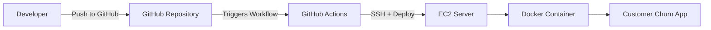

# <center>CI/CD pipeline  for Automated Deployment of Customer Churn Analysis</center>

This repository sets up a **CI/CD pipeline** using **GitHub Actions** to automatically build and deploy the [Customer Churn Analysis](https://github.com/adityasuresh013/Customer-Churn-Analysis) project to an **Ubuntu AWS EC2** instance using **SSH** and **Docker**.

<center></center>

---

## Table of Contents

1. [Overview](#overview)
2. [Architecture](#architecture)
3. [Prerequisites](#prerequisites)
4. [GitHub Actions Workflow](#github-actions-workflow)
5. [Security Notes](#security-notes)
6. [Future Improvements](#future-improvements)

---

## Overview

This repo complements the main [Customer Churn Analysis](https://github.com/adityasuresh013/Customer-Churn-Analysis) project by enabling continuous deployment using GitHub Actions. Every time a change is pushed to the main branch of the source repo, the workflow will:

1. SSH into the EC2 server
2. Clone/update the latest project code
3. Rebuild the Docker container
4. Restart the application

This ensures **zero manual deployment steps** after each code update.

---

## Architecture



---

## Prerequisites

### 1. AWS EC2 Instance (Ubuntu)

* Open ports: **22 (SSH)** and **80/8501** for app access.
* Docker installed on the instance.

### 2. GitHub Repository Secrets

Go to GitHub repo → Settings → Secrets and Variables → Actions → Add these secrets:

| Name       | Description                                                |
| ---------- | ---------------------------------------------------------- |
| `EC2_PUBLIC_IP` | Public IP of EC2 instance                                  |
| `UBUNTU_AWS`  | **Private SSH Key** of `.pem` file                         |

---

## GitHub Actions Workflow

The `.github/workflows/deploy.yml` file defines the CI/CD pipeline. Key steps include:

```yaml
name: Deploy Flask App to EC2 using Docker

on:
  push:
    branches:
      - main  # Triggers the workflow when pushing to the main branch

jobs:
  deploy:
    runs-on: ubuntu-latest

    steps:
    - name: Checkout code
      uses: actions/checkout@v2
      with:
        ref: main  # Fetch the latest code from the main branch

    - name: SSH to EC2 and deploy Flask app
      uses: appleboy/ssh-action@v1.2.0
      with:
        host: ${{ secrets.EC2_PUBLIC_IP }}
        username: ubuntu
        key: ${{ secrets.UBUNTU_AWS }}
        port: 22
        script: |
        
          set -e  # Exit immediately if a command fails

          sudo apt update -y

          rm -r /home/ubuntu/Project/customer-churn
          echo "Deleted old customer-churn"

          # Navigate to or create the project directory
          if [ ! -d "/home/ubuntu/Project/customer-churn" ]; then
              echo "NO DIR༼ つ ◕_◕ ༽つ"
              mkdir -p /home/ubuntu/Project
              git clone https://x-access-token:${{ secrets.GITHUB_TOKEN }}@github.com/AdityaSuresh013/customer-churn.git /home/ubuntu/Project/customer-churn
          fi
          cd /home/ubuntu/Project/customer-churn

          # Pull the latest changes
          git pull origin main

          # Check and install Docker if necessary
          if ! command -v docker &> /dev/null
          then
              echo "Docker not found, installing Docker..."
              sudo apt-get update -y
              sudo apt-get install -y docker.io
          fi

          # Build Docker image
          docker build -t flask-app .

          # Stop and remove existing container if running
          if [ "$(docker ps -aq -f name=flask-app)" ]; then
              docker stop flask-app
              docker rm flask-app
          fi

          # Run the Docker container
          docker run -d -p 80:80 --name flask-app --restart unless-stopped flask-app

```

---

## Security Notes

* Never expose `.pem` private key publicly.
* Always use GitHub Secrets to store sensitive variables.
* Use firewalls on EC2 to limit access.

---

## Future Improvements

* Add **unit tests and linting** stages before deployment.
* Add **Slack or email notifications** on workflow success/failure.
* Support **multi-environment deployment** (dev/staging/prod).
* Add **GitHub Actions artifacts** for logs or reports.

---

